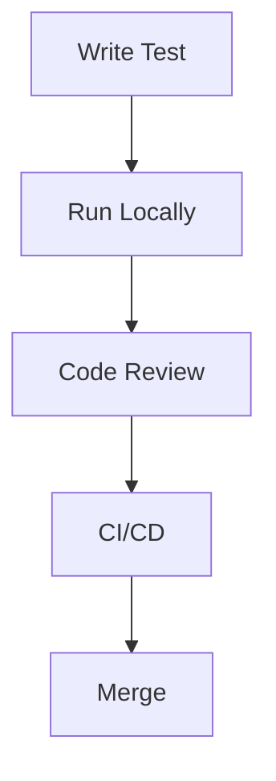

# Test Suite Standards

## Overview

This document defines the standards and conventions for the Webbly CMS test suite. Following these standards ensures consistency, maintainability, and reliability of tests.

## Code Standards

### Test File Structure
```python
"""Module docstring explaining test category and purpose."""

import pytest
from tests.fixtures import assert_valid_response

# Constants
TEST_DATA = {
    'key': 'value'
}

# Fixtures (if file-specific)
@pytest.fixture
def test_resource():
    """Fixture docstring."""
    resource = setup_resource()
    yield resource
    cleanup_resource(resource)

# Test Classes (for related tests)
class TestFeature:
    """Class docstring explaining feature being tested."""
    
    def test_success_case(self):
        """Test successful operation."""
        # Arrange
        data = prepare_test_data()
        
        # Act
        result = feature_under_test(data)
        
        # Assert
        assert_valid_response(result)
    
    def test_error_case(self):
        """Test error handling."""
        with pytest.raises(ValueError):
            feature_under_test(invalid_data)
```

### Naming Conventions

#### Test Files
```python
# Unit tests
test_user.py
test_post.py

# Integration tests
test_user_post_integration.py

# Feature tests
test_authentication_flow.py
```

#### Test Functions
```python
def test_feature_success():
    """Test successful case."""
    pass

def test_feature_invalid_input():
    """Test invalid input case."""
    pass

def test_feature_error_handling():
    """Test error handling."""
    pass
```

### Documentation Standards

#### Module Documentation
```python
"""
User authentication tests.

This module contains tests for:
- User login
- User logout
- Password reset
- Session management

Dependencies:
- pytest
- pytest-mock
- auth_fixtures
"""
```

#### Function Documentation
```python
def test_user_login():
    """
    Test user login functionality.
    
    Steps:
    1. Prepare valid credentials
    2. Attempt login
    3. Verify success response
    4. Check session state
    
    Dependencies:
    - test_user fixture
    - auth_service
    """
```

## Testing Standards

### Test Categories

#### Unit Tests
```python
def test_unit():
    """
    Unit test standards:
    - Test single component
    - Mock dependencies
    - Fast execution
    - No external services
    """
    pass
```

#### Integration Tests
```python
def test_integration():
    """
    Integration test standards:
    - Test component interaction
    - Minimal mocking
    - Real dependencies
    - Proper cleanup
    """
    pass
```

#### Functional Tests
```python
def test_functional():
    """
    Functional test standards:
    - Test complete feature
    - End-to-end flow
    - Real environment
    - User perspective
    """
    pass
```

### Test Quality Standards

#### Coverage Requirements
```python
# Minimum coverage requirements
COVERAGE_REQUIREMENTS = {
    'unit': 90,        # 90% unit test coverage
    'integration': 80, # 80% integration test coverage
    'functional': 70   # 70% functional test coverage
}
```

#### Performance Requirements
```python
# Maximum execution time limits
TIME_LIMITS = {
    'unit': 0.1,       # 100ms per unit test
    'integration': 1.0, # 1s per integration test
    'functional': 5.0   # 5s per functional test
}
```

### Test Implementation Standards

#### Arrange-Act-Assert Pattern
```python
def test_standard_pattern():
    """Follow AAA pattern."""
    # Arrange
    user = create_test_user()
    
    # Act
    result = user.perform_action()
    
    # Assert
    assert result.success
```

#### Resource Management
```python
def test_resource_management():
    """Proper resource management."""
    resource = acquire_resource()
    try:
        use_resource(resource)
    finally:
        cleanup_resource(resource)
```

## Quality Assurance

### Code Review Standards

#### Review Checklist
```python
REVIEW_CHECKLIST = {
    'documentation': True,  # Complete documentation
    'coverage': True,       # Meets coverage requirements
    'performance': True,    # Meets performance requirements
    'style': True          # Follows style guide
}
```

#### Review Process
1. Self-review
2. Automated checks
3. Peer review
4. Final approval

### Testing Process

#### Development Flow


#### Continuous Integration
```yaml
# CI requirements
ci:
  tests:
    - lint
    - unit
    - integration
    - security
```

## Security Standards

### Security Testing
```python
def test_security():
    """
    Security test standards:
    - Test authentication
    - Test authorization
    - Test input validation
    - Test data protection
    """
    pass
```

### Data Handling
```python
# Sensitive data handling
SENSITIVE_DATA = {
    'passwords': 'hashed',
    'tokens': 'encrypted',
    'pii': 'masked'
}
```

## Maintenance Standards

### Code Organization
```
tests/
├── unit/          # Unit tests
├── integration/   # Integration tests
├── functional/    # Functional tests
├── fixtures/      # Test fixtures
└── utils/         # Test utilities
```

### Documentation Maintenance
- Update with code changes
- Keep examples current
- Review regularly
- Version control

## Best Practices

### Test Independence
```python
def test_independent():
    """
    Test independence standards:
    - No shared state
    - No test interdependence
    - Clean environment
    - Isolated resources
    """
    pass
```

### Error Handling
```python
def test_error_handling():
    """
    Error handling standards:
    - Test error cases
    - Verify error messages
    - Check error states
    - Proper cleanup
    """
    pass
```

## Compliance

### Code Style
- Follow PEP 8
- Use Black formatter
- Run linters
- Maintain consistency

### Documentation
- Complete docstrings
- Clear examples
- Updated README
- Maintained CHANGELOG

## Version Control

### Commit Standards
```
feat: add new test feature
fix: correct test behavior
docs: update test documentation
style: format test code
refactor: improve test structure
```

### Branch Strategy
```
main
├── feature/add-tests
├── fix/test-issue
└── docs/test-docs
```

## Review Process

### Submission Requirements
- Tests pass
- Coverage met
- Documentation complete
- Style consistent

### Review Criteria
- Code quality
- Test effectiveness
- Documentation clarity
- Performance impact

## Enforcement

### Automated Checks
- Linting
- Formatting
- Coverage
- Performance

### Manual Reviews
- Code review
- Documentation review
- Security review
- Architecture review

Remember:
- Follow standards consistently
- Update documentation
- Maintain quality
- Review regularly
- Enforce compliance
